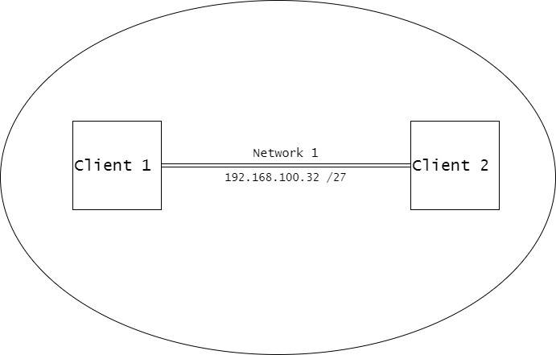

<h1 align="center">Network Design</h1>

## Desktop Operating System COMP 3105

<h2>Steps to Follow</h2>

1. Use VMware to create the VMs (Virtual Machines).
1. Create two VMs using a Windows 10 Enterprise; name the VMs and the computers with your `“first name”` Client#. E.g., `PrithviClient1`, `PrithviClient2`, etc.… (Make sure your re-name the client computers once windows are installed)
1. Set up a network between the two client machines. Use the last two IP host addresses of the subnet given above.
1. Set the Firewall inbound and outbound rules and allow the clients to ping each other.
1. Activate the built in Administrator Account.
1. Create three users on `Client1` and mirror these users on `Client2`. (Bob, Sue, Joan)
1. Sign in a Bob on Client2. Create a folder on Client 2 called `“your name”` work (e.g., `prithviWork`) and share it with Sue and Joan. Use read/write share permission for all users.
1. Create a file in the folder created above called `“your name”` test.txt (e.g., `prithviText.txt`).
1. Set the permission of the file `“your name”` text.txt for Sue as read only, using basic permissions.
1. Create a Hyper-V instance on Client1 called `“your name”` testVM (e.g., `PrithviTestVM`) and install windows 10 on the instance.
1. Set the account lockout threshold on the local security policies to 3 attempts.
1. To receive full marks, you will have to show methods and answer questions, about the project.
